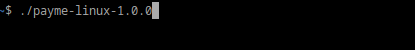

# 0xMeProtocol

## PayMe

### Roll you own local server.

**Supported platforms**

* Linux,
* MacOS and
* Windows

**Instructions**

1. Git clone or download this repository as a zip, then
2. From a terminal (or 'Command Prompt')
3. Run the version of the app matching your platform.
4. Browse to the URL displayed in your terminal

**Linux example**

